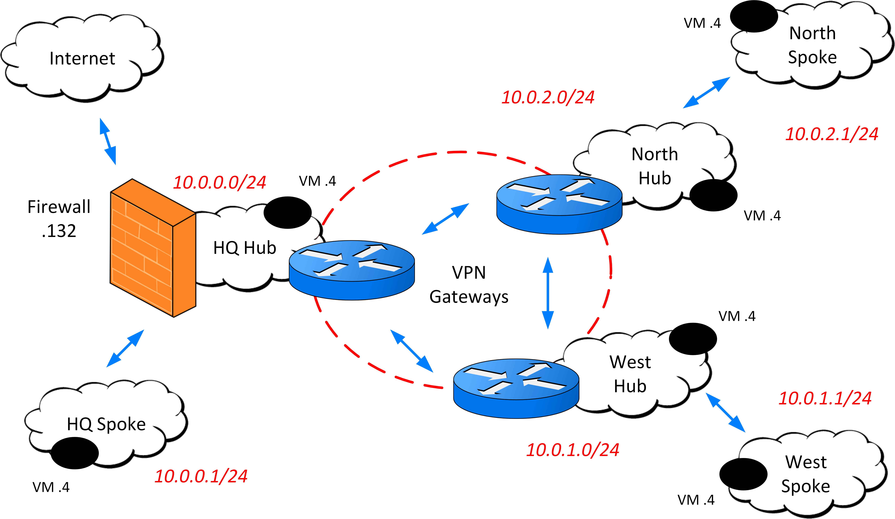

# Geo Redundant VPN

This repository contains a presentation as well as the required Powershell scripts to build a demonstration on Geo Redundant VPN based on Azure Viryual Network Gateways. The objectives are:
- Setup a Geo Redunant VPN, based on BGP routing over 2 Azure Regions and 3 sites:
- On Premise Network Connection considerations
- Setup monitoring for BGP Peers

The environment can be build running BuildDemo.ps1 in an Azure Subscription. It will create:
- 3 Resource Groups, each having:
- 2 Virtual Networks (Hub and Spoke), having 1, 2 or 3 SubNets
- 2 Route Tables, associated to the subnets
- 2 Virtual Machines (Linux RHEL), in the Default Subnet
- 3 Virtual Network Gateways
- VNet Peerings between Hub and Spoke Virtual Networks
- Site-to-Site VPN (IPSEC) connections (Full Mesh between 3 sites)
- 1 Azure Firewall, including route table content for first site (HQ)
- Network Watcher monitoring, versions 1 and 2

